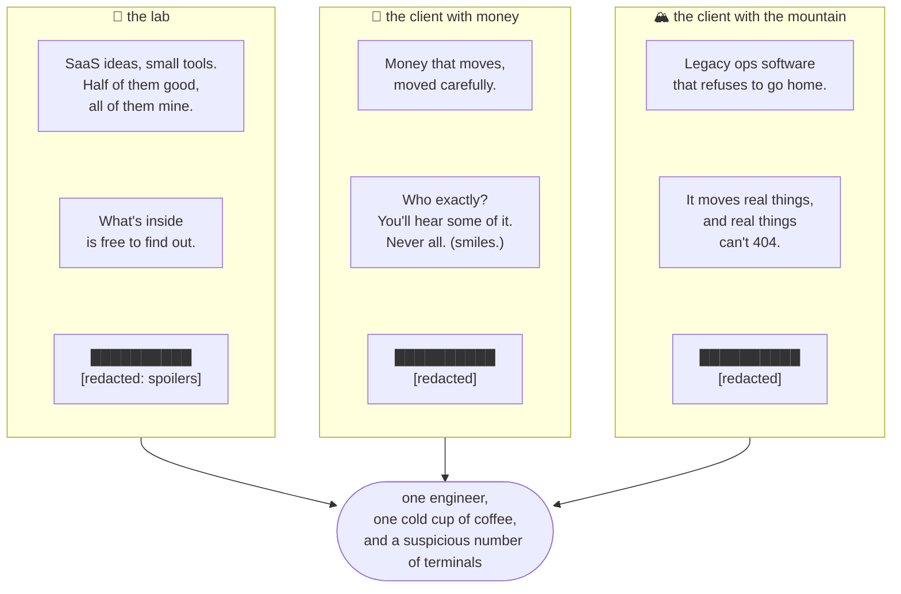

# Waqid

Backend engineer. Infrastructure tinkerer. Surabaya, Indonesia.

I build things that are meant to be forgotten — until they're not running.

---

## The three desks

The desks are real. The labels got redacted before you could ask.

I keep secrets for a living — NDAs are less a clause than a lifestyle —
so client names, screens, and details stay off this page. If you were
hoping to social-engineer the rest out of a README: hi, you've been
spotted, and no. I can say it warmly, in Indonesian or English.

---

## Lately

Building [tomocash](https://github.com/tmrw-id/tomocash) — POS for Indonesian warung. Running [vio](https://github.com/waqid/vio) — Git-native hosting in Rust.
Managing K3s clusters that survive being ignored on weekends.
Archived 50+ projects into era monorepos. Down to the ones that matter.
Saying "I can't talk about that" more than any other sentence.

---

## Craft

`PHP` `Laravel` `PostgreSQL` `Linux` `Rust` `Kubernetes` `GitOps` `SvelteKit`

Boring technology, DDD where it earns its keep, infrastructure that doesn't page at 3 AM.

---

## Principles

- A system that wakes you up at 3 AM is a system you designed wrong.
- Security that creates friction is a design failure, not a tradeoff.
- Ship the ugly version. Refine it when it matters.
- Delete what doesn't serve. Archive the rest.

---

## Off the clock

Coffee, usually cold by the time I remember it.
Small people with big opinions — my harshest code reviewers.
And a homelab I keep describing as "temporary."

---

[dama.id](https://dama.id) · [LinkedIn](https://linkedin.com/in/waqidid)
